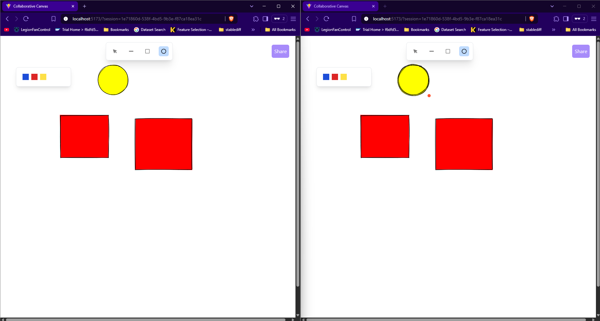

# colaborative-canvas

A real-time collaborative whiteboard app built with React, Yjs, and WebRTC, inspired by Excalidraw. Multiple users can draw simultaneously on a shared canvas and see updates in real time.



# 🚀 Features

🖌️ Freehand drawing with multiple stroke colors

🧑‍🤝‍🧑 Real-time collaboration using Yjs + y-webrtc

📍 Live cursors with user identifiers

🔄 State synchronization across peers

# 🧰 Tech Stack

Frontend: React + TypeScript + TailwindCSS

Collaboration: Yjs, y-webrtc

Drawing: roughjs

```cmd

cd frontend
npm install
npm run dev
```

# 🔗 Usage

- Create a Room
  A unique room ID is generated (UUID or slug). This ID is shared in the URL.

- Invite Collaborators
  Send the URL to your friends or team members.

- Start Drawing
  Everyone in the room sees each other's strokes and live cursors.
